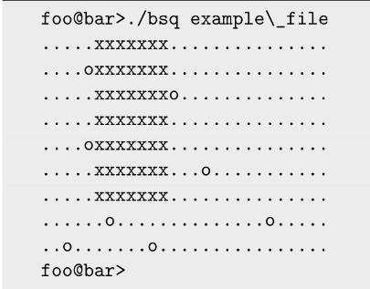

# Bsq

Il s'agit de trouver le plus grand carré possible dans une map composé de ".' et 'o'.
La map est transmise en deuxième argument du programme en fichier texte (.txt). Dans la première ligne du fichier texte (map), on y retrouve un chiffre qui correspond au nombre de lignes de la map suivies d’un saut à la ligne (\n). la map composée de ‘.’ et ‘o', aura pour forme un rectangle c'est-à-dire que chaque ligne de la map aura la même longueur avec un saut à la ligne pour chacune des lignes.

## But du programme

Le but est de remplacer les '.' par des 'x' est de former un carré le plus grand dans un espace de la map. 

## Fonctions autorisées

```
	. Open
	. Close
	. Exit 
	. Read
	. Exit
``

## Mise en route

Ces instructions vous permettront d'obtenir une copie du projet opérationnel sur votre machine locale à des fins de développement et de test.

### Pré-requis

De quoi avez-vous besoin pour installer le logiciel et comment l'installer ?

```
gcc
make
```

### Installation

Compilation du projet

```
make
```

Lancement du projet

```
./bsq map.txt
```

## Captures d'écrans




